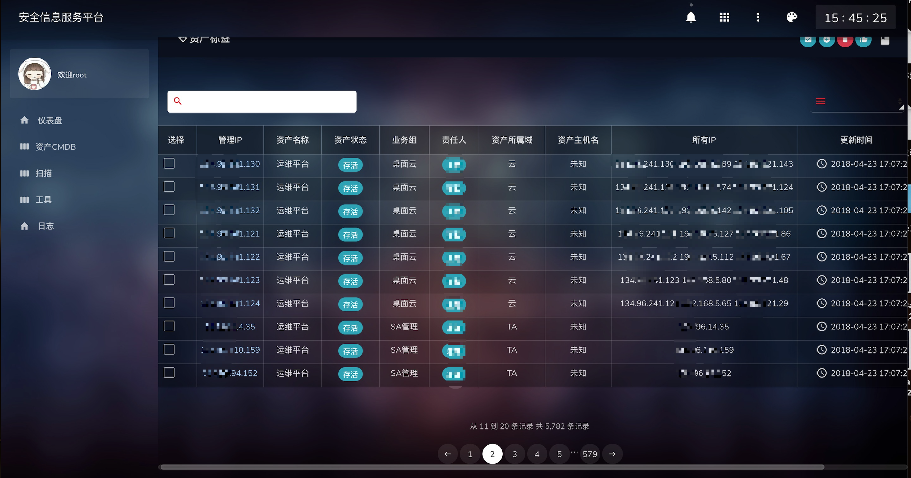
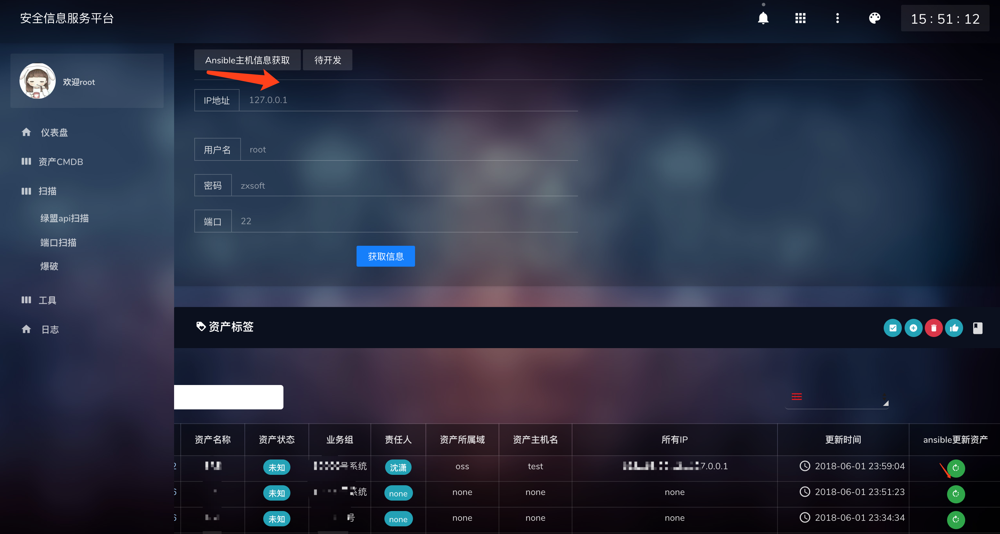
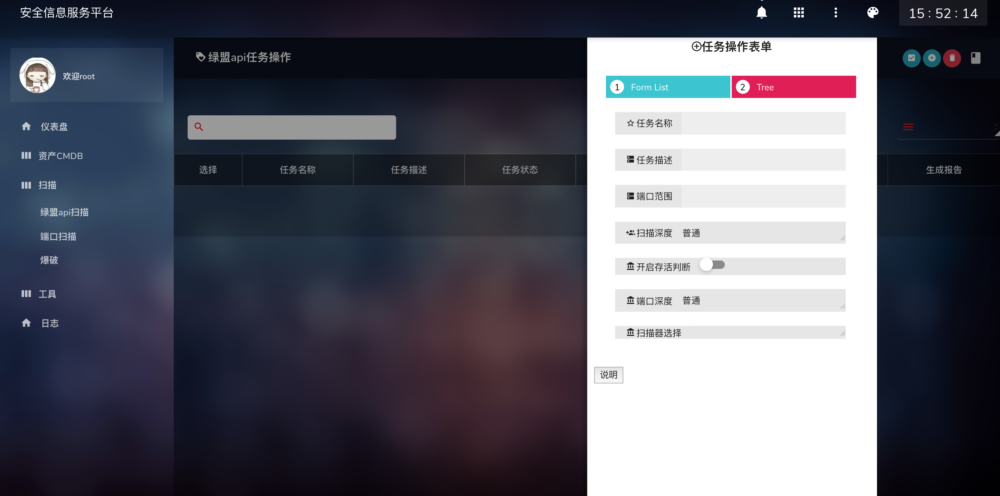
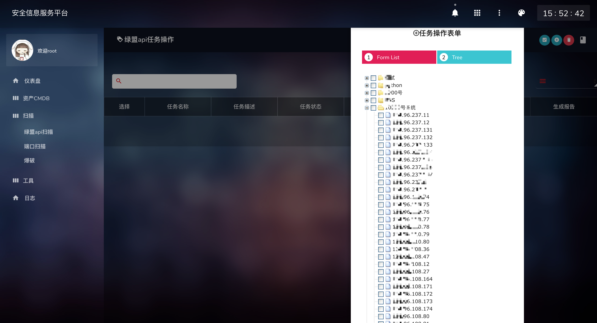
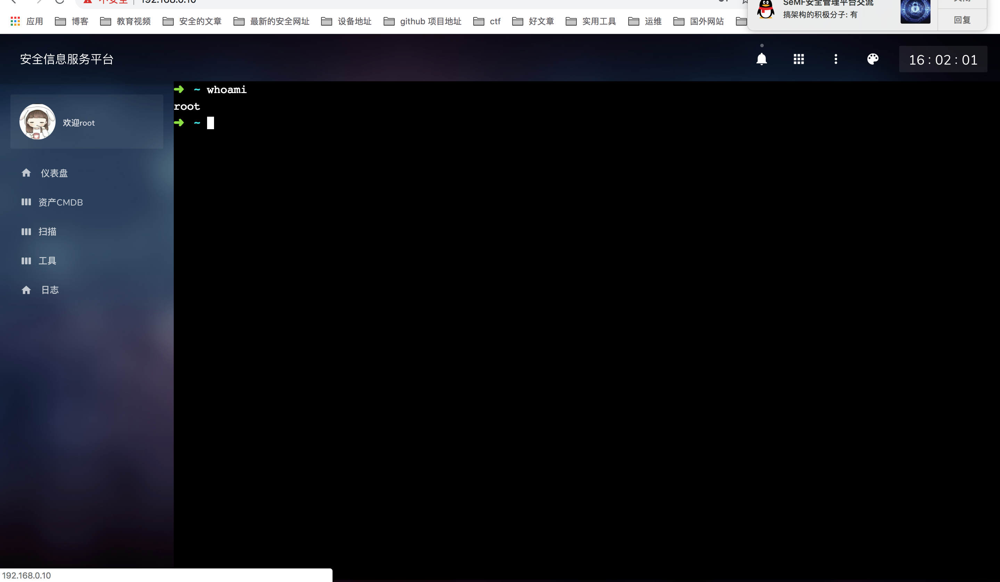

# safe_scan
开源的安全扫描项目

## safe_scan 是什么
safe_scan是集合有CMDB主机资产管理。漏洞扫描，主机监控的个人开源平台

## 开发语言与框架：
 * 编程语言：Python2.7 + HTML + JScripts
 * 前端Web框架：Bootstrap
 * 后端Web框架：Django
 * 后端Task框架：Celery + Redis
 * 监控工具： ansible
 * 漏扫框架：绿盟API
 
 
## 功能

* 资产的管理
* 端口扫描
* 弱口令爆破
* 漏洞扫描
* Ansible 主机应监控报告进程，用户，端口。
* webSSH管理
* 异常告警

## 部分功能截图:
资产列表：

ansible信息手动或自动获取

漏扫任务

主机详情

webssh

